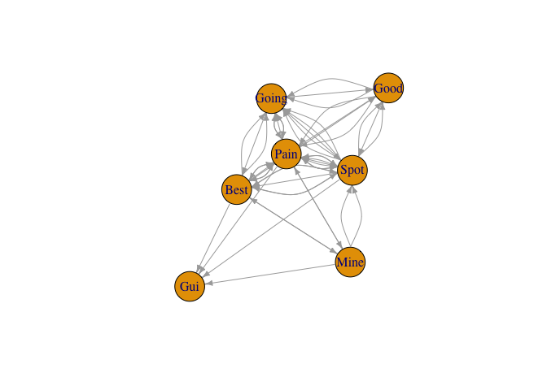
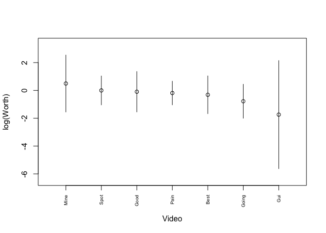
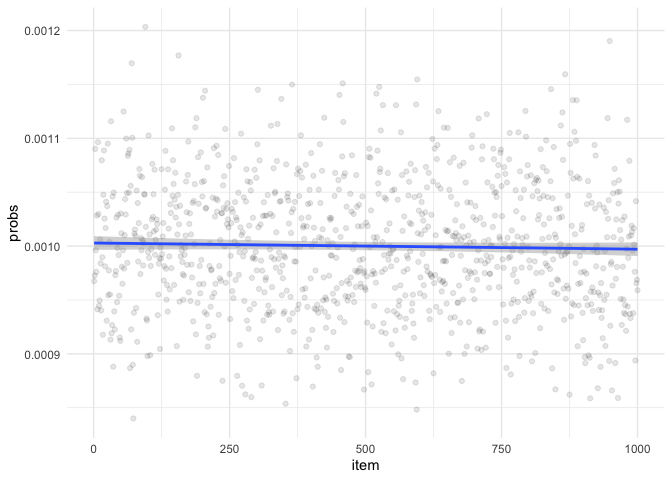
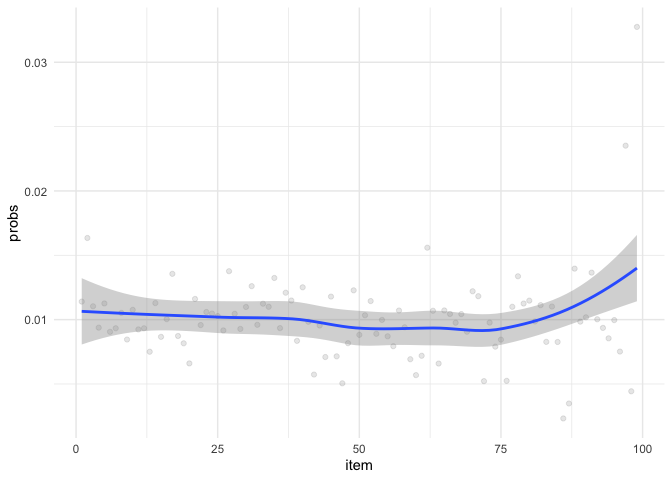

An Introduction to the PlackettLuce Model
================
Peter Rabinovitch
2023-03-18 11:39:14

``` r
library(tidyverse)
library(PlackettLuce)
library(igraph)
library(tictoc)
```

# Intro

# Plackett Luce

<https://cran.r-project.org/web/packages/PlackettLuce/vignettes/Overview.html>

“Spot”, “3 Ways to Spot a Bad Statistic”, “Mine”, “Was A Minecraft
Speedrunner Too Lucky To Pull Off His World Record?”, “Best”, “The best
stats you’ve ever seen”, “Going”, “Data Science: Where are We Going?”,
“Pain”, “Statistics Without the Agonizing Pain”, “GUI”, “You can’t do
data science in a GUI”, “Good”, “What does it take to apply data science
for social good?”

``` r
vdf <- structure(list(viewer = c("a", "a", "a", "a", "a", "b", "b", 
"b", "b", "c", "c", "c", "c", "d", "d", "d", "d", "e", "e", "e", 
"e", "f", "f", "f", "f", "g", "g", "g", "g", "g"), video = c("Spot", 
"Best", "Pain", "Good", "Going", "Best", "Pain", "Spot", "Going", 
"Mine", "Spot", "Pain", "Best", "Spot", "Good", "Going", "Pain", 
"Going", "Good", "Pain", "Spot", "Spot", "Pain", "Going", "Best", 
"Best", "Pain", "Mine", "Spot", "Gui"), rank = c(1, 2, 3, 4, 
5, 1, 2, 3, 4, 1, 2, 3, 4, 1, 2, 3, 4, 1, 2, 3, 4, 1, 2, 3, 4, 
1, 2, 3, 4, 5)), row.names = c(NA, -30L), class = c("tbl_df", 
"tbl", "data.frame"))
```

``` r
vdf %>%
  group_by(video, rank) %>%
  summarize(n = n()) %>%
  pivot_wider(
    names_from = rank,
    values_from = n
  ) %>%
  replace_na(list(`1` = 0, `2` = 0, `3` = 0, `4` = 0, `5` = 0)) %>%
  mutate(ttl = `1` + `2` + `3` + `4` + `5`) %>%
  select(`1`, `2`, `3`, `4`, `5`,ttl)
```

    ## `summarise()` has grouped output by 'video'. You can override using the
    ## `.groups` argument.
    ## Adding missing grouping variables: `video`

    ## # A tibble: 7 × 7
    ## # Groups:   video [7]
    ##   video   `1`   `2`   `3`   `4`   `5`   ttl
    ##   <chr> <int> <int> <int> <int> <int> <int>
    ## 1 Best      2     1     0     2     0     5
    ## 2 Going     1     0     2     1     1     5
    ## 3 Good      0     2     0     1     0     3
    ## 4 Gui       0     0     0     0     1     1
    ## 5 Mine      1     0     1     0     0     2
    ## 6 Pain      0     3     3     1     0     7
    ## 7 Spot      3     1     1     2     0     7

``` r
R <- vdf %>%
  pivot_wider(
    names_from = video,
    values_from = rank
  ) %>%
  select(-viewer) %>%
  replace_na(list(Spot = 0, Going = 0, Good = 0, Mine = 0, Pain = 0, Spot = 0, GUI = 0)) %>%
  as.matrix()
```

``` r
R
```

    ##      Spot Best Pain Good Going Mine Gui
    ## [1,]    1    2    3    4     5    0  NA
    ## [2,]    3    1    2    0     4    0  NA
    ## [3,]    2    4    3    0     0    1  NA
    ## [4,]    1   NA    4    2     3    0  NA
    ## [5,]    4   NA    3    2     1    0  NA
    ## [6,]    1    4    2    0     3    0  NA
    ## [7,]    4    1    2    0     0    3   5

``` r
R <- as.rankings(R)
```

``` r
R
```

    ## [1] "Spot > Best > Pain > Good > Going" "Best > Pain > Spot > Going"       
    ## [3] "Mine > Spot > Pain > Best"         "Spot > Good > Going > Pain"       
    ## [5] "Going > Good > Pain > Spot"        "Spot > Pain > Going > Best"       
    ## [7] "Best > Pain > Mine > Spot > Gui"

``` r
net <- graph_from_adjacency_matrix(adjacency(R))
plot(net, edge.arrow.size = 0.5, vertex.size = 30)
```

<!-- -->

``` r
mod <- PlackettLuce(R)
summary(mod)
```

    ## Call: PlackettLuce(rankings = R)
    ## 
    ## Coefficients:
    ##       Estimate Std. Error z value Pr(>|z|)
    ## Spot   0.00000         NA      NA       NA
    ## Best  -0.31365    0.86332  -0.363    0.716
    ## Pain  -0.18718    0.67236  -0.278    0.781
    ## Good  -0.09439    0.90861  -0.104    0.917
    ## Going -0.77772    0.81854  -0.950    0.342
    ## Mine   0.49644    1.06279   0.467    0.640
    ## Gui   -1.73958    1.94972  -0.892    0.372
    ## 
    ## Residual deviance:  46.588 on 44 degrees of freedom
    ## AIC:  58.588 
    ## Number of iterations: 8

``` r
coef(mod) # log of worth
```

    ##        Spot        Best        Pain        Good       Going        Mine 
    ##  0.00000000 -0.31364937 -0.18717966 -0.09438936 -0.77772081  0.49644437 
    ##         Gui 
    ## -1.73958108

``` r
qv <- qvcalc(mod)
qv$qvframe <- qv$qvframe[order(coef(mod), decreasing = TRUE), ]
plot(qv, xlab = "Video", ylab = "log(Worth)", main = NULL, xaxt = "n")
axis(1, at = seq_len(length(coef(mod))), labels = rownames(qv$qvframe), las = 2, cex.axis = 0.6)
```

<!-- -->

``` r
itempar(mod) %>% sort(decreasing = TRUE)
```

    ##       Mine       Spot       Good       Pain       Best      Going        Gui 
    ## 0.28582013 0.17397617 0.15830586 0.14427752 0.12713747 0.07993370 0.03054916

``` r
# itempar(mod) == exp(coef(mod))/sum(exp(coef(mod)))
```

# Scaling to bigger problems —-

``` r
n_videos <- 1000
n_viewers <- 100000
e_n_ratings <- 5
```

# this can take a while!

``` r
tic()
df_ratings <- tibble()
n_ratings <- pmax(1, rpois(n_viewers, e_n_ratings))
for (i in 1:n_viewers) {
  ratings <- sample(n_videos, n_ratings[i])
  ans <- tibble(rater = i, videos = ratings, ratings = 1:n_ratings[i])
  df_ratings <- df_ratings %>% bind_rows(ans)
}
toc() # 275s
```

    ## 291.467 sec elapsed

``` r
# this can take a while!
tic()
R1 <- df_ratings %>%
  pivot_wider(
    names_from = videos,
    values_from = ratings
  ) %>%
  select(-rater) %>%
  mutate(
    across(everything(), ~ replace_na(.x, 0))
  ) %>%
  as.matrix()
toc() # 5s
```

    ## 2.879 sec elapsed

``` r
tic()
mod1 <- PlackettLuce(R1)
```

    ## Rankings with only 1 item set to `NA`

``` r
toc()
```

    ## 70.661 sec elapsed

``` r
# 70s
# 773 s, 18 GiB for n_viewers = 1M
```

``` r
tibble(item = 1:length(coef(mod1)), probs = exp(coef(mod1)) / sum(exp(coef(mod1)))) %>%
  ggplot(aes(x = item, y = probs)) +
  geom_point(alpha = 0.1) +
  geom_smooth() +
  theme_minimal()
```

    ## `geom_smooth()` using method = 'gam' and formula = 'y ~ s(x, bs = "cs")'

<!-- -->

``` r
################################################################################
# Biased ratings ----

n_videos <- 100
n_viewers <- 1000
e_n_ratings <- 5
```

``` r
df_ratings <- tibble()
n_ratings <- pmax(1, rpois(n_viewers, e_n_ratings))
for (i in 1:n_viewers) {
  ratings <- sample(n_videos, n_ratings[i], prob = 1:n_videos) # change is here with 'prob'
  ans <- tibble(rater = i, videos = ratings, ratings = 1:n_ratings[i])
  df_ratings <- df_ratings %>% bind_rows(ans)
}
```

``` r
R2 <- df_ratings %>%
  pivot_wider(
    names_from = videos,
    values_from = ratings
  ) %>%
  select(-rater) %>%
  mutate(
    across(everything(), ~ replace_na(.x, 0))
  ) %>%
  as.matrix()
```

``` r
mod2 <- PlackettLuce(R2)
```

    ## Rankings with only 1 item set to `NA`

``` r
tibble(item = 1:length(coef(mod2)), probs = exp(coef(mod2)) / sum(exp(coef(mod2)))) %>%
  ggplot(aes(x = item, y = probs)) +
  geom_point(alpha = 0.1) +
  geom_smooth() +
  theme_minimal()
```

    ## `geom_smooth()` using method = 'loess' and formula = 'y ~ x'

<!-- -->

``` r
################################################################################
# Videos, item covariates ----

R3 <- vdf %>%
  pivot_wider(
    names_from = video,
    values_from = rank
  ) %>%
  select(-viewer) %>%
  replace_na(list(Spot = 0, Going = 0, Good = 0, Mine = 0, Pain = 0, Best = 0, GUI = 0)) %>%
  as.matrix()
```

``` r
R3
```

    ##      Spot Best Pain Good Going Mine Gui
    ## [1,]    1    2    3    4     5    0  NA
    ## [2,]    3    1    2    0     4    0  NA
    ## [3,]    2    4    3    0     0    1  NA
    ## [4,]    1    0    4    2     3    0  NA
    ## [5,]    4    0    3    2     1    0  NA
    ## [6,]    1    4    2    0     3    0  NA
    ## [7,]    4    1    2    0     0    3   5

``` r
features <- tibble(
  video = c("Spot", "Best", "Pain", "Good", "Going", "Mine"), 
  gender = c("F", "M", "M", "M", "F", "F"), 
  len = c(10, 15, 8, 20, 20, 70)
  )
features
```

    ## # A tibble: 6 × 3
    ##   video gender   len
    ##   <chr> <chr>  <dbl>
    ## 1 Spot  F         10
    ## 2 Best  M         15
    ## 3 Pain  M          8
    ## 4 Good  M         20
    ## 5 Going F         20
    ## 6 Mine  F         70

``` r
Rr <- R3 %>% as.rankings()
```

``` r
standardPL_PlackettLuce <- PlackettLuce(Rr)
summary(standardPL_PlackettLuce)
```

    ## Call: PlackettLuce(rankings = Rr)
    ## 
    ## Coefficients:
    ##       Estimate Std. Error z value Pr(>|z|)
    ## Spot   0.00000         NA      NA       NA
    ## Best  -0.31365    0.86332  -0.363    0.716
    ## Pain  -0.18718    0.67236  -0.278    0.781
    ## Good  -0.09439    0.90861  -0.104    0.917
    ## Going -0.77772    0.81854  -0.950    0.342
    ## Mine   0.49644    1.06279   0.467    0.640
    ## Gui   -1.73958    1.94972  -0.892    0.372
    ## 
    ## Residual deviance:  46.588 on 44 degrees of freedom
    ## AIC:  58.588 
    ## Number of iterations: 8

``` r
# note residual deviance = 37 -> rho = 37/20~2
```

``` r
standardPL <- pladmm(R3, ~ gender + len, data = features, rho = 2)
summary(standardPL)
```

``` r
################################################################################
# videos, rater covariates

judge_features <- vdf %>%
  mutate(
    jf=if_else(viewer %in% c('a','d','f'),1,2)
  ) %>% 
  group_by(viewer)%>%
  summarize( jf=first(jf))%>%
  select(jf)
judge_features
```

``` r
grouped_videos <- group(as.rankings(R3), 1:nrow(R3))
grouped_videos
mod3 <- pltree(grouped_videos ~ ., data = judge_features,rho = 2)
plot(mod3, ylines = 1)
mod3
```

``` r
################################################################################
# videos, item & rater covariates

grouped_videos <- group(as.rankings(R3), 1:nrow(R3))
grouped_videos
mod4 <- pltree(
  grouped_videos ~ ., 
  worth =~ gender + len ,
  data = list(judge_features, features),
  rho = 2)
plot(mod4, ylines = 1)
mod4
```

``` r
################################################################################
################################################################################
library(tidyverse)
library(PlackettLuce)
library(igraph)
library(prefmod)


salad %>% glimpse()
# Model 1 - plain----
mod1 <- PlackettLuce(salad)
summary(mod1)

# Model 2 - item covariates----
salad_features <- tibble(salad = LETTERS[1:4], acetic = c(0.5, 0.5, 1, 0), gluconic = c(0, 10, 0, 10))
salad_features 

mod2 <- pladmm(salad, ~ salad, data = salad_features, rho = 8)
summary(mod2)


# Model 3 - rater covariates----
set.seed(1)
judge_features <- tibble(varC = rpois(nrow(salad), lambda = salad$C^2))
judge_features
grouped_salad <- group(as.rankings(salad), 1:nrow(salad))
grouped_salad
mod3 <- pltree(grouped_salad ~ ., data = judge_features,rho = 2, minsize = 10)
plot(mod3, ylines = 2)
mod3
```

``` r
# Model 4 - rater covariates and item covariates----
set.seed(1)
judge_features <- tibble(varC = rpois(nrow(salad), lambda = salad$C^2))
grouped_salad <- group(as.rankings(salad), 1:nrow(salad))

mod4 <- pltree(
  grouped_salad ~ ., 
  worth = ~acetic + gluconic, 
  data = list(judge_features, salad_features),
  rho = 2, minsize = 10
)
plot(mod4, ylines = 2)
mod4
```

``` r
# Model 3A - rater covariates----
set.seed(1)
judge_features <- tibble(varC=c(rep(1,5),rep(2,11),rep(3,16)))
judge_features
grouped_salad <- group(as.rankings(salad), 1:nrow(salad))
grouped_salad
mod3 <- pltree(grouped_salad ~ ., data = judge_features,rho = 2, minsize = 10)
plot(mod3, ylines = 4)
mod3
```

# Appendices

<details>
<summary>
References
</summary>
</details>
<details>
<summary>
SessionInfo
</summary>

``` r
sessionInfo()
```

    ## R version 4.2.2 (2022-10-31)
    ## Platform: x86_64-apple-darwin17.0 (64-bit)
    ## Running under: macOS Big Sur ... 10.16
    ## 
    ## Matrix products: default
    ## BLAS:   /Library/Frameworks/R.framework/Versions/4.2/Resources/lib/libRblas.0.dylib
    ## LAPACK: /Library/Frameworks/R.framework/Versions/4.2/Resources/lib/libRlapack.dylib
    ## 
    ## locale:
    ## [1] en_US.UTF-8/en_US.UTF-8/en_US.UTF-8/C/en_US.UTF-8/en_US.UTF-8
    ## 
    ## attached base packages:
    ## [1] stats     graphics  grDevices utils     datasets  methods   base     
    ## 
    ## other attached packages:
    ##  [1] tictoc_1.1         igraph_1.4.1       PlackettLuce_0.4.2 lubridate_1.9.2   
    ##  [5] forcats_1.0.0      stringr_1.5.0      dplyr_1.1.0        purrr_1.0.1       
    ##  [9] readr_2.1.4        tidyr_1.3.0        tibble_3.1.8       ggplot2_3.4.1     
    ## [13] tidyverse_2.0.0   
    ## 
    ## loaded via a namespace (and not attached):
    ##  [1] Rcpp_1.0.10        mvtnorm_1.1-3      lattice_0.20-45    zoo_1.8-11        
    ##  [5] digest_0.6.31      utf8_1.2.2         gmp_0.6-9          RSpectra_0.16-1   
    ##  [9] R6_2.5.1           evaluate_0.19      highr_0.10         pillar_1.8.1      
    ## [13] qvcalc_1.0.2       rlang_1.0.6        rstudioapi_0.14    rpart_4.1.19      
    ## [17] Matrix_1.5-3       partykit_1.2-16    rmarkdown_2.19     labeling_0.4.2    
    ## [21] splines_4.2.2      bit_4.0.5          munsell_0.5.0      compiler_4.2.2    
    ## [25] xfun_0.36          pkgconfig_2.0.3    mgcv_1.8-41        CVXR_1.0-11       
    ## [29] libcoin_1.0-9      htmltools_0.5.4    tidyselect_1.2.0   matrixStats_0.63.0
    ## [33] fansi_1.0.3        psychotree_0.16-0  tzdb_0.3.0         withr_2.5.0       
    ## [37] grid_4.2.2         nlme_3.1-161       gtable_0.3.1       lifecycle_1.0.3   
    ## [41] magrittr_2.0.3     scales_1.2.1       cli_3.6.0          stringi_1.7.8     
    ## [45] farver_2.1.1       Rmpfr_0.8-9        ellipsis_0.3.2     generics_0.1.3    
    ## [49] vctrs_0.5.2        sandwich_3.0-2     Formula_1.2-4      tools_4.2.2       
    ## [53] bit64_4.0.5        glue_1.6.2         hms_1.1.2          fastmap_1.1.0     
    ## [57] survival_3.5-3     yaml_2.3.6         timechange_0.1.1   colorspace_2.0-3  
    ## [61] inum_1.0-4         knitr_1.41         psychotools_0.7-2

</details>
